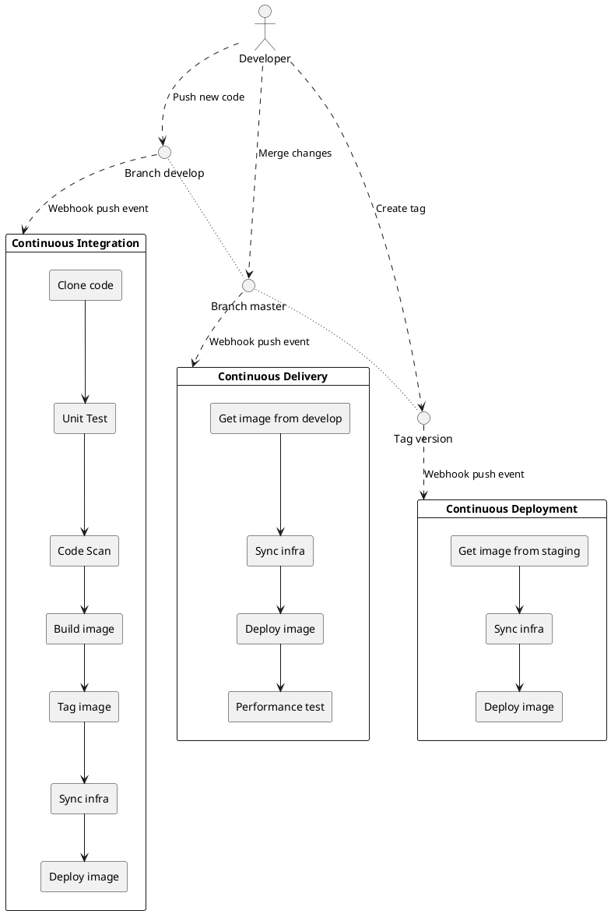

# Openshift CI/CD Demo

This repo contains all files needed to execute Caio's CI/CD demo over Openshift 4.x.

Environment simulated in this demo:

* **Develop:** place where all developers integrate their changes.
* **Staging:** futher similar with production where automated and manual quality gates can be performed.
* **Production:** customers use services available here.

Branching strategy:



## Prerequisites

* 1x Openshift Container Platform version 4.5 or later.
* Helm CLI installed in your workstation.
* OC CLI installed in your workstation.

## Step by step

### Prepare

1. Clone this repo:

    ```bash
    git clone https://github.com/caiomedeirospinto/ocp-cicd-demo.git
    ```

2. Login to Openshift with an Cluster admin account.
3. Create projects:

    ```bash
    helm template charts/bootstrap-project/ | oc apply -f -
    ```

### Do it with GitOps

> INFO!
>
> To execute this step by step, you gonna need ArgoCD CLI installed.

1. Install Openshift GitOps:

    ```bash
    oc apply -f operators/gitops/operator/
    ```

    Wait a minute and execute:

    ```bash
    oc apply -f operators/gitops/service/
    ```

2. Wait for Openshift GitOps to be ready:

    ```bash
    oc get pods -n openshift-gitops
    ```

    <details>
    <summary>Ver output esperado.</summary>
    <p>

    ```bash
    NAME                                                              READY   STATUS    RESTARTS   AGE
    cluster-78779b6d4c-2bk2f                                      1/1     Running   0          3h29m
    kam-6764ccc9c-dpwxg                                           1/1     Running   0          3h29m
    openshift-gitops-application-controller-0                     1/1     Running   0          3h29m
    openshift-gitops-applicationset-controller-5d9f9998f8-kf4k9   1/1     Running   0          3h29m
    openshift-gitops-redis-7867d74fb4-j28gv                       1/1     Running   0          3h29m
    openshift-gitops-repo-server-579776b7d6-vd568                 1/1     Running   0          3h29m
    openshift-gitops-server-84fcb8547c-zbmsm                      1/1     Running   0          3h29m
    ```

    </p>
    </details>

3. Deploy YAML Online product:

    ```bash
    helm template -f charts/ubiquitous-journey/app-of-apps.yaml charts/ubiquitous-journey/ | oc apply -n openshift-gitops -f -
    ```

    > INFO!
    >
    > Some code are based on [Ubiquitous Project](https://github.com/rht-labs/ubiquitous-journey), so if you wanna find more amazing tools as a code check it out!

4. Wait for ArgoCD apps get ready:

    ```bash
    argocd login "$(oc get route openshift-gitops-server -n openshift-gitops -o go-template='{{ .spec.host }}')" --username admin \
        --password "$(oc get secrets openshift-gitops-cluster -n openshift-gitops -o go-template='{{index .data "admin.password"}}' | base64 --decode)"
    ```

5. Simulates a push event to develop Git webhook calling to event listener:

    ```bash
    curl "$(oc get route )"
    ```

6. Login to Openshift Web Console, go to Developer view and to the project `dev`:


7. Wait for

### Do it without GitOps

